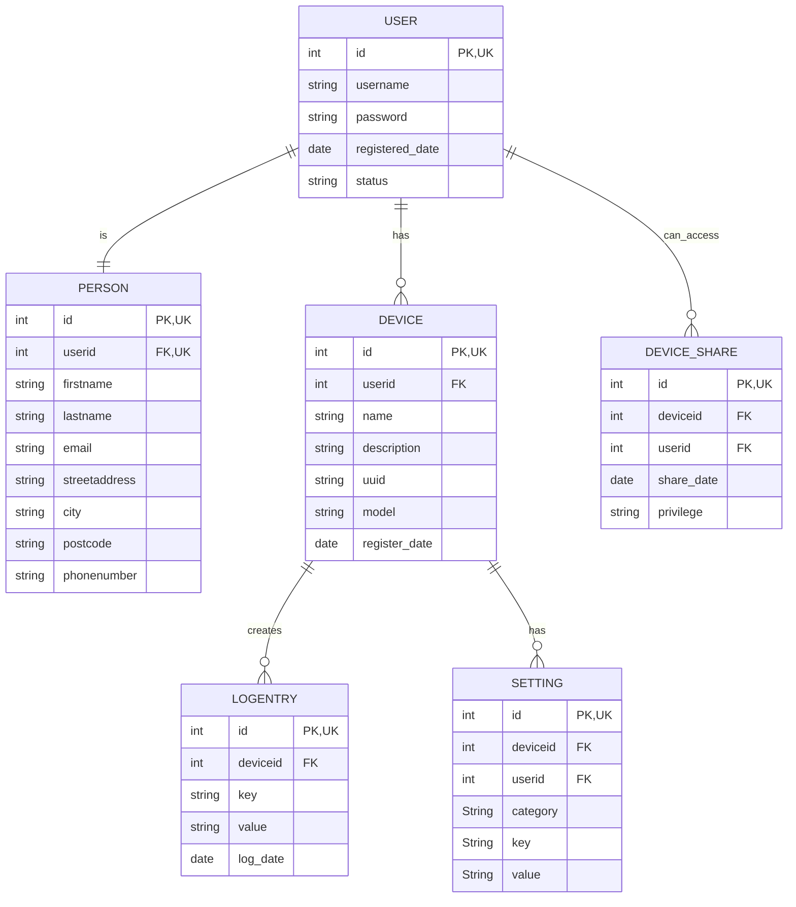

# OTP1
OTP1 Software Engineering Project 1

## Tehtävät

- tuntilista(https://metropoliafi-my.sharepoint.com/:x:/g/personal/tonihirv_metropolia_fi/Ea14dZ-eydxItsQ5Mh2XgPcBL7n6WQnzVAWS_SRhqxHraQ?e=UqqDKj&nav=MTVfezAwMDAwMDAwLTAwMDEtMDAwMC0wMDAwLTAwMDAwMDAwMDAwMH0)
- projectplan _ markdown/github
- productvision _ markdown/github
- setup trello
- setup team
- presentation link(https://docs.google.com/presentation/d/1MlfKxJ8iGxZMGYpVgSVQCBMqi3PgQaskcB6KySv8td0/edit#slide=id.g3268e255a1e_0_438)

## Muu dokumentaatio

- [DB ERD](./db.md)
- [Palvelimen asennuksesta](./install.md)
- [Luokkakaavio UML](./uml.md)
- [API deployment](server/README.md)

Bruno API testauksen määrittelyt [bruno/](bruno/) hakemistossa, lokaali ja remote API:lle

### Mikrokontrolleri

- Description: A platform to manage iot sensors. Get temperature, add lower and upper limits with actions for crossing the limits. Track temperature over time.
- Features:
    - Register user account
    - Add and connect devices to the account
    - View temperature
    - View logged temperatures
    - Set upper and lower limits for temperatures
    - Set an action for crossing set temperatures

- Microcontroller side:
    - Connect to wifi network
    - Connect to an API
    - Read temperature sensor
    - Pinout according to set action
    - Technologies: JavaFX, MariaDB, ESP8266, NodeJS, ExpressJS

## Trello

- Product backlog(https://trello.com/b/qHL6mSgy/otp1-product-backlog)
- Sprint 1(https://trello.com/b/WIYIIN36/otp1-sprint1)
- Sprint 2(https://trello.com/b/IqVvURY3/otp1-sprint2)
- Sprint 3(https://trello.com/b/sWQ92Kam/otp1-sprint3)
- Sprint 4(https://trello.com/b/28VbEdLX/otp1-sprint4)

## DB relations:

