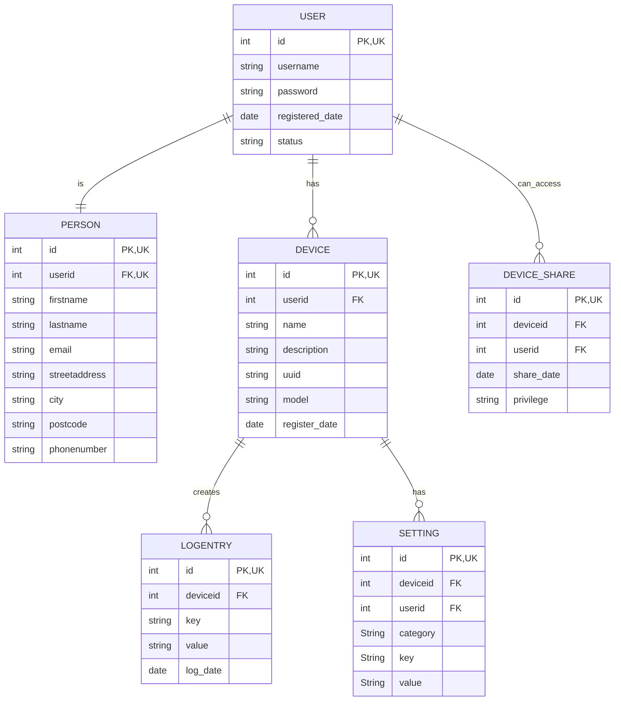

## db

```
ssh -L 3306:127.0.0.1:3306 otp1.0x6a4b.dev -p 22666
```

```
mariadb -u [ADMINUSER] -h 127.0.0.1 -P 3306 -p
```

```
create database i_spy_u;
create database i_spy_u_test;
create user 'appuser'@'%' identified by 'PASSWORD';
grant all on i_spy_u.* to 'appuser'@'%';
grant all on i_spy_u_test.* to 'appuser'@'%';
```

