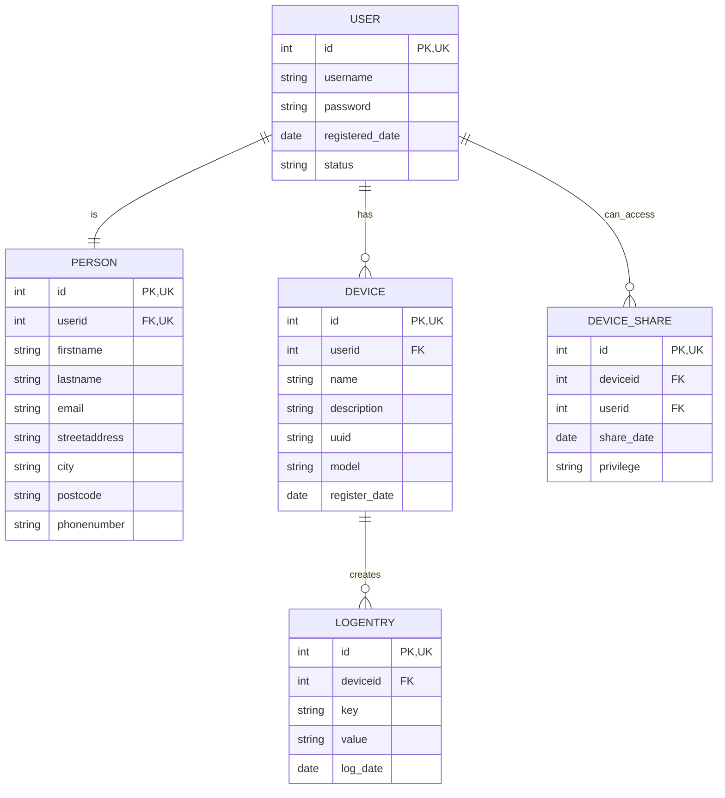

```mermaid

erDiagram
    USER 1--1 PERSON : is
    USER 1--0+ DEVICE : has
    DEVICE 1--0+ LOGENTRY : creates
    USER 1--0+ DEVICE_SHARE : can_access

    USER {
        int id PK,UK
        string username
        string password
        date registered_date
        string status
    }

    PERSON {
        int id PK,UK
        int userid FK,UK
        string firstname
        string lastname
        string email
        string streetaddress
        string city
        string postcode
        string phonenumber
    }

    DEVICE {
        int id PK,UK
        int userid FK 
        string name
        string description
        string uuid
        string model
        date register_date
    }

    LOGENTRY {
        int id PK,UK
        int deviceid FK
        string key
        string value
        date log_date
    }

    DEVICE_SHARE {
        int id PK,UK
        int deviceid FK
        int userid FK
        date share_date
        string privilege
    }


```
