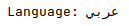

# Localization API

i18n, l10n

## Resource bundle handling

Class will automatically load every translation property file saved in correct format, e.g.
>Translation_fi_FI.properties


## Language name localized

```
instance.getTranslation("language");
```


## Date format

Long date time format


```
instance.getLongFormattedDateTime(date);
```

Short date time format


```
instance.getShortFormattedDateTime(date);
```

---
Long date format


```
instance.getLongFormattedDate(date);
```

Short date format


```
instance.getShortFormattedDate(date);
```

## Translation

Get translation. Case insensitive, converts spaces to underscores (_)
> Edit Device  
gets converted to  
edit_device

```
instance.getTranslation("login")
```

## Getting and setting locale

Get available locales as List<Locale>
```
instance.getAvailableLocales();
```

Set selected locale
```
instance.setLocale(locale);
```

## Reading direction

Get locale's reading direction, is it right to left

```
instance.isRightToLeft()
```
Return value
>true / false


## Number formatting

Get formatting for numbers

Decimal format


```
instance.getFormattedDouble(12.34)
```

Percentage format

```
instance.getFormattedPercent(0.5)
```

Currency format

```
instance.getFormattedCurrency(12.34)
```

Temperature format

```
instance.getFormattedTemperature(12.34)
```