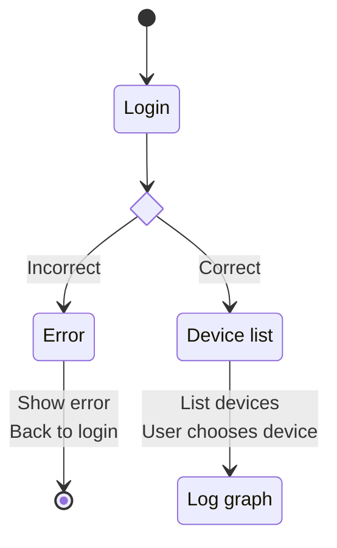
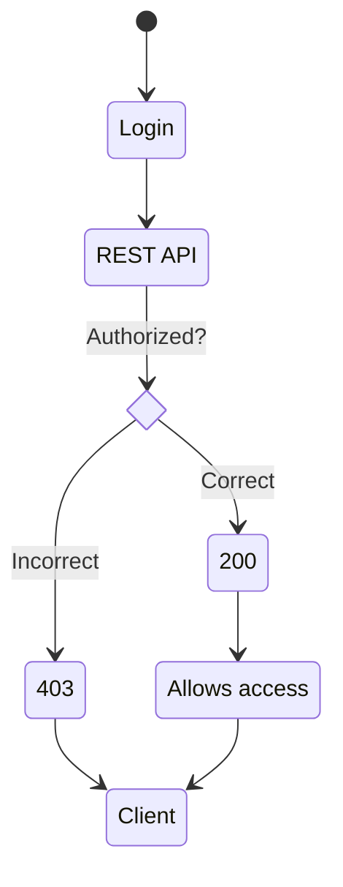
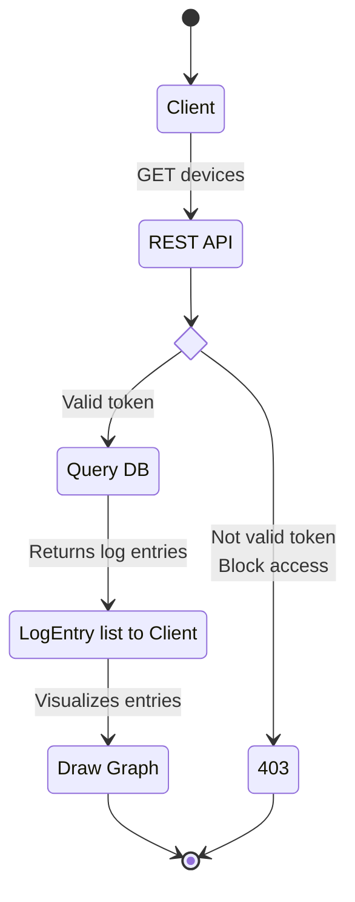

# Activity diagram

### Login GUI

```mermaid
stateDiagram
    state login_success <<choice>>
    Show_log_graph: Log graph
    Device_view: Device list


    [*] --> Login
    Login --> login_success
    login_success --> Error: Incorrect
    login_success --> Device_view: Correct
    Device_view --> Show_log_graph: List devices<br>User chooses device
    Error --> [*]: Show error<br>Back to login
```

### Login

```mermaid
stateDiagram
    state login_success <<choice>>
    REST_API: REST API
    Allow_access: Allows access

    [*] --> Login
    Login --> REST_API
    REST_API --> login_success: Authorized?
    login_success --> 403: Incorrect
    login_success --> 200: Correct
    403 --> Client
    200 --> Allow_access
    Allow_access --> Client
    
```

### GET logs

```mermaid
stateDiagram
    state authorized <<choice>>
    LogEntry_list_to_Client: LogEntry list to Client
    Draw_Graph: Draw Graph
    DB_Query: Query DB
    REST_API: REST API

    [*] --> Client
    Client --> REST_API: GET devices
    REST_API --> authorized
    authorized --> 403: Not valid token<br>Block access
    authorized --> DB_Query: Valid token
    DB_Query --> LogEntry_list_to_Client: Returns log entries
    LogEntry_list_to_Client --> Draw_Graph: Visualizes entries
    
    Draw_Graph --> [*]
    403 --> [*]

```

