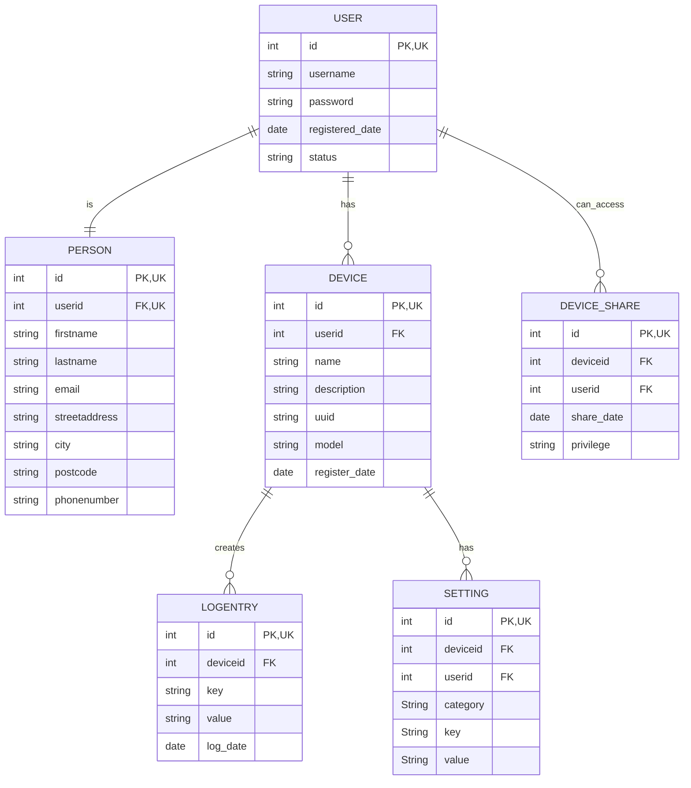

## db


### Security

MariaDB port closed to outside world, only possible to connect via SSH tunnel now

Application user appuser allowed to connect only from tunneled connection so not possible to use adminer with that user


### Setting up application user and database

Tunnel to the mariadb server;
```
ssh -L 3306:127.0.0.1:3306 otp1.0x6a4b.dev -p 22666
```

If tunnel keeps closing, it can be kept open with an ugly gimmick:
```
watch -n 60 echo "Keeping tunnel open"
```

Maria shell as admin:
```
mariadb -u [ADMINUSER] -h 127.0.0.1 -P 3306 -p
```

Create databases and app user for backend:
```
create database i_spy_u;
create database i_spy_u_test;
create user 'appuser'@'%' identified by 'PASSWORD';
grant all on i_spy_u.* to 'appuser'@'%';
grant all on i_spy_u_test.* to 'appuser'@'%';
show grants for 'appuser'@'%';
```

