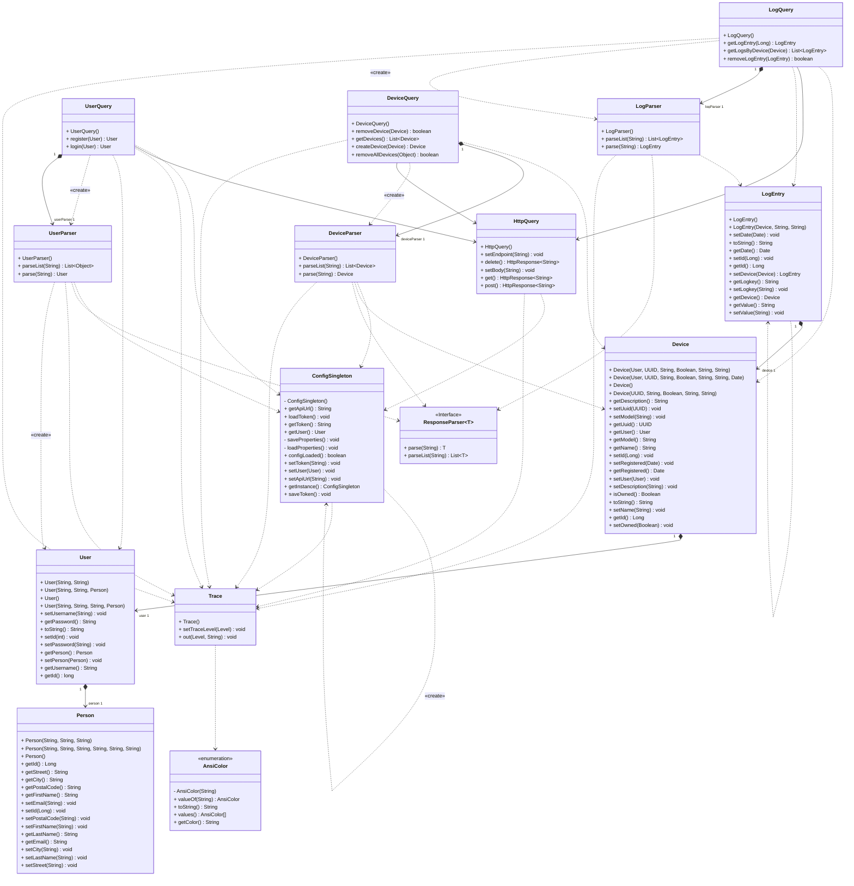

### HTTP Query

```mermaid
classDiagram
    class HttpQuery {
        + HttpQuery() 
        + setEndpoint(String) void
        + delete() HttpResponse~String~
        + setBody(String) void
        + get() HttpResponse~String~
        + post() HttpResponse~String~
    }

    class LogQuery {
        + LogQuery() 
        + getLogEntry(Long) LogEntry
        + getLogsByDevice(Device) List~LogEntry~
        + removeLogEntry(LogEntry) boolean
    }

    class LogParser {
        + LogParser() 
        + parseList(String) List~LogEntry~
        + parse(String) LogEntry
    }

    class UserQuery {
        + UserQuery() 
        + register(User) User
        + login(User) User
    }

    class UserParser {
        + UserParser() 
        + parseList(String) List~Object~
        + parse(String) User
    }

    class DeviceParser {
        + DeviceParser() 
        + parseList(String) List~Device~
        + parse(String) Device
    }

    class DeviceQuery {
        + DeviceQuery() 
        + removeDevice(Device) boolean
        + getDevices() List~Device~
        + createDevice(Device) Device
        + removeAllDevices(Object) boolean
    }

    class ResponseParser~T~ {
        <<Interface>>
        + parse(String) T
        + parseList(String) List~T~
    }

    class LogEntry {
        + LogEntry() 
        + LogEntry(Device, String, String) 
        + setDate(Date) void
        + toString() String
        + getDate() Date
        + setId(Long) void
        + getId() Long
        + setDevice(Device) LogEntry
        + getLogkey() String
        + setLogkey(String) void
        + getDevice() Device
        + getValue() String
        + setValue(String) void
    }

    class Device {
        + Device(User, UUID, String, Boolean, String, String) 
        + Device(User, UUID, String, Boolean, String, String, Date) 
        + Device() 
        + Device(UUID, String, Boolean, String, String) 
        + getDescription() String
        + setUuid(UUID) void
        + setModel(String) void
        + getUuid() UUID
        + getUser() User
        + getModel() String
        + getName() String
        + setId(Long) void
        + setRegistered(Date) void
        + getRegistered() Date
        + setUser(User) void
        + setDescription(String) void
        + isOwned() Boolean
        + toString() String
        + setName(String) void
        + getId() Long
        + setOwned(Boolean) void
    }

    class User {
        + User(String, String) 
        + User(String, String, Person) 
        + User() 
        + User(String, String, String, Person) 
        + setUsername(String) void
        + getPassword() String
        + toString() String
        + setId(int) void
        + setPassword(String) void
        + getPerson() Person
        + setPerson(Person) void
        + getUsername() String
        + getId() long
    }

    class Person {
        + Person(String, String, String) 
        + Person(String, String, String, String, String, String) 
        + Person() 
        + getId() Long
        + getStreet() String
        + getCity() String
        + getPostalCode() String
        + getFirstName() String
        + setEmail(String) void
        + setId(Long) void
        + setPostalCode(String) void
        + setFirstName(String) void
        + getLastName() String
        + getEmail() String
        + setCity(String) void
        + setLastName(String) void
        + setStreet(String) void
    }

    class AnsiColor {
        <<enumeration>>
        - AnsiColor(String) 
        + valueOf(String) AnsiColor
        + toString() String
        + values() AnsiColor[]
        + getColor() String
    }

    class ConfigSingleton {
        - ConfigSingleton() 
        + getApiUrl() String
        + loadToken() void
        + getToken() String
        + getUser() User
        - saveProperties() void
        - loadProperties() void
        + configLoaded() boolean
        + setToken(String) void
        + setUser(User) void
        + setApiUrl(String) void
        + getInstance() ConfigSingleton
        + saveToken() void
    }

    class Trace {
        + Trace() 
        + setTraceLevel(Level) void
        + out(Level, String) void
    }

    DeviceParser  ..>  ConfigSingleton 
    DeviceParser  ..>  Device 
    DeviceParser  ..>  ResponseParser~T~ 
    DeviceParser  ..>  Trace 
    DeviceQuery  ..>  Device 
    DeviceQuery "1" *--> "deviceParser 1" DeviceParser 
    DeviceQuery  ..>  DeviceParser : «create»
    DeviceQuery  -->  HttpQuery 
    DeviceQuery  ..>  Trace 
    ConfigSingleton  ..>  ConfigSingleton : «create»
    ConfigSingleton  ..>  Trace 
    Trace  ..>  AnsiColor 
    User "1" *--> "person 1" Person 
    UserParser  ..>  ConfigSingleton 
    UserParser  ..>  ResponseParser~T~ 
    UserParser  ..>  Trace 
    UserParser  ..>  User : «create»
    UserQuery  ..>  ConfigSingleton 
    UserQuery  -->  HttpQuery 
    UserQuery  ..>  Trace 
    UserQuery  ..>  User 
    UserQuery  ..>  UserParser : «create»
    UserQuery "1" *--> "userParser 1" UserParser 
    LogParser  ..>  LogEntry 
    LogParser  ..>  ResponseParser~T~ 
    LogParser  ..>  Trace 
    LogQuery  ..>  Device 
    LogQuery  -->  HttpQuery 
    LogQuery  ..>  LogEntry 
    LogQuery "1" *--> "logParser 1" LogParser 
    LogQuery  ..>  LogParser : «create»
    LogQuery  ..>  Trace 
    LogEntry "1" *--> "device 1" Device 
    LogEntry  ..>  LogEntry 
    HttpQuery  ..>  ConfigSingleton 
    HttpQuery  ..>  Trace 
    Device "1" *--> "user 1" User 
    
```