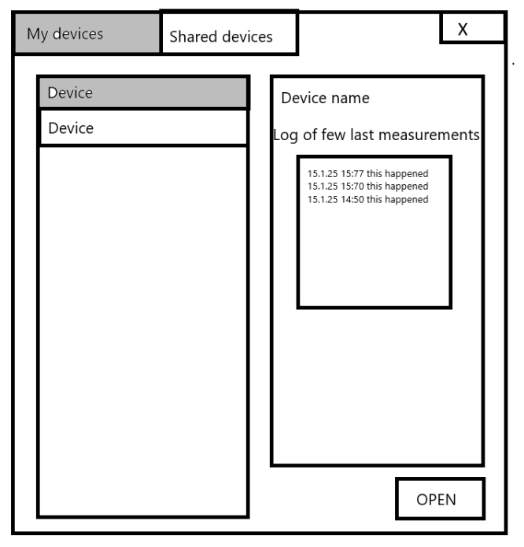
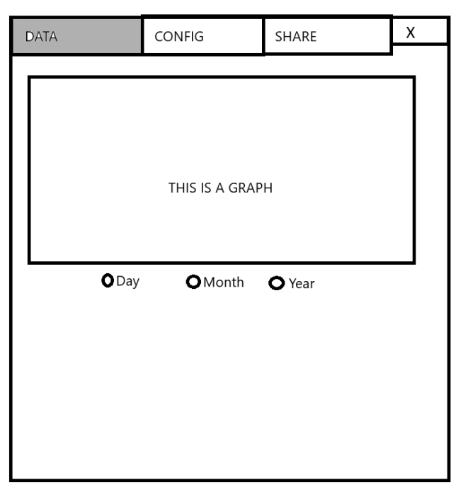
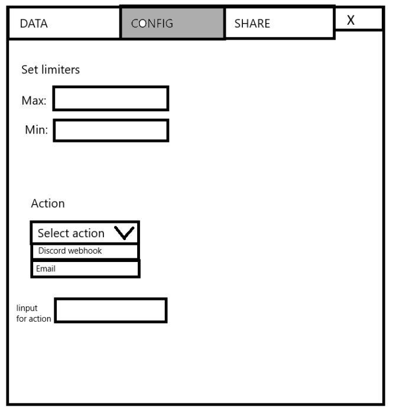
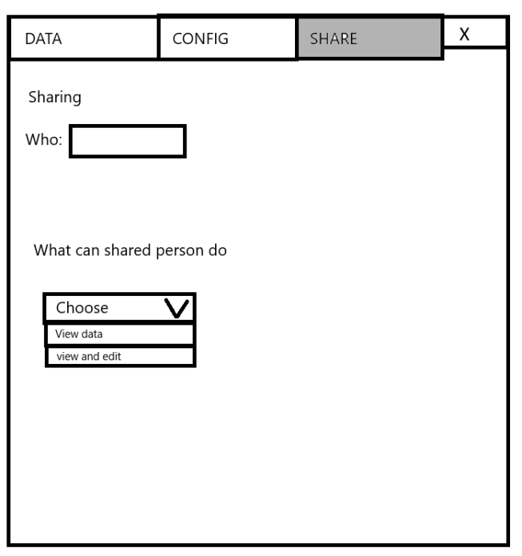

# Project Plan

**Group 9**

### 1. Introduction
  - **Project Title**: I-SPY-U
  - **Project Description**: Monitoring of properties or valuables.
  - **Objectives**: A functional and reliable system for sensor management.
  - **Scope**: 
    - **Included**:
        - Server for handling sensor data, client UI for representing and managing sensor devices.
    - **Excluded**:
        - Sensor device is currently excluded in the scope for the 4 first sprints.

### 2. Project Organization
  - **Team Structure**:
    - Eino Ruuth: UI
    - Joonas Karppinen: Server
    - Toni Hirvikallio: Client business logic
    - Niko Meriluoto: DB
  - **Communication Plan**: Daily scrums, weekly meetings and sprint meetings at the beginning of every sprint.
  - **Stakeholder Involvement**: Team members are the sole stakeholders, fully engaged in planning, designing and developing of the product.

### 3. Risk Analysis
  - **Risk Description**:
    - Inadequate timeframe
    - Device malfunctions for sensors, microcontrollers or computers
    - Server malfunctions or breakdowns
    - Software limitations
    - Supply chain issues for sensors and chips
  - **Likelihood**:
    - Timeframe medium
    - Hardware low
    - Software medium
  - **Impact**:
    - Timeframe low
    - Hardware high
    - Software medium
  - **Mitigation Strategies**:
    - Timeframe: careful planning
    - Hardware: backup server, microcontroller and sensors
    - Software: thorough research

### 4. Hardware and Software Resource Requirements
  - **Hardware**:
    - Server
    - Microcontroller(s)
    - Sensor(s)
  - **Software**:
    - Docker
    - Ide
    - Spring boot
    - JDK
    - JavaFX
    - MQTT
    - ESP8266 FreeRTOS SDK
    - Jenkins
    - Websocket
    - Discord API

### 5. Work Breakdown
  - **Task Description**:  
    1.0 Sensor management system  
        &nbsp;&nbsp;1.1 Client side software  
            &nbsp;&nbsp;&nbsp;&nbsp;1.1.1 UI  
            &nbsp;&nbsp;&nbsp;&nbsp;1.1.2 Businesslogic  
        &nbsp;&nbsp;1.2 Server side software  
            &nbsp;&nbsp;&nbsp;&nbsp;1.2.1 Backend API  
            &nbsp;&nbsp;&nbsp;&nbsp;1.2.2 Database  
            &nbsp;&nbsp;&nbsp;&nbsp;1.2.3  
        &nbsp;&nbsp;1.3 Microcontroller  
            &nbsp;&nbsp;&nbsp;&nbsp;1.3.1 Microcontroller software  
            &nbsp;&nbsp;&nbsp;&nbsp;1.3.2 Sensors  
  - **Dependencies**:
    - UI is finish-to-finish dependent on businesslogic
    - Backend is finish-to-finish dependent on DB
    - Businesslogic is finish-to-finish dependent on backend
  - **Team Member Assignment**: Responsibilities will be shared and cycled

### 6. Project Schedule
  - **Timeline**:
    - requirement gathering
    - design
    - development
    - testing
    - deployment
  - **Milestones**:
    - Project setup
    - Backend/API endpoints
    - Basic client interface
    - User authentication
    - Functioning sensor

  - **Gantt Chart or Timeline**:

  |Task name|Start date|End date|Sprint 1.1|Sprint 1.2|Sprint 2.1|Sprint 2.2|Sprint 3.1|Sprint 3.2|Sprint 4.1|Sprint 4.2|
  |------|--|--|--|--|--|--|--|--|--|--|
  |Project planning|13.01|20.01|X|X||
  |Setup|20.01|27.01||X||
  |UI Design|27.01|03.02|||X|
  |DB Design|20.01|27.01||X|
  |Business Logic|03.02|10.02|||X|X|X|
  |IOT Dev|10.02|17.02|||||X|

### 7. Monitoring and Reporting Mechanisms
  - **Progress Tracking**: Trello
  - **Reporting**:
    - To team members through daily scrums
    - To stakeholders through sprint reviews

### Appendixes

### UI Design prototype  

First drafts of the UI Design prototypes

 

*The main view of the client, showing user's devices*

 

*Device view showing graph of logged measurements*

 

*Config view allowing user to configure thresholds and actions*

 

*Share view allowing user to configure sharing of the device*

