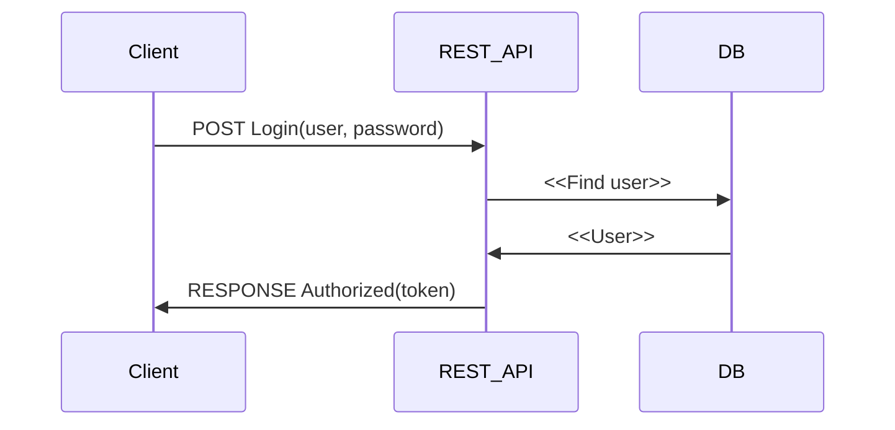
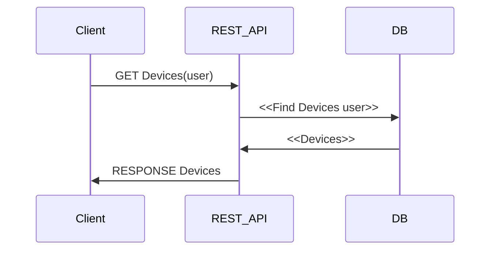
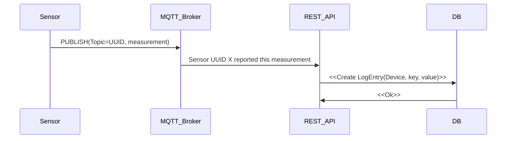
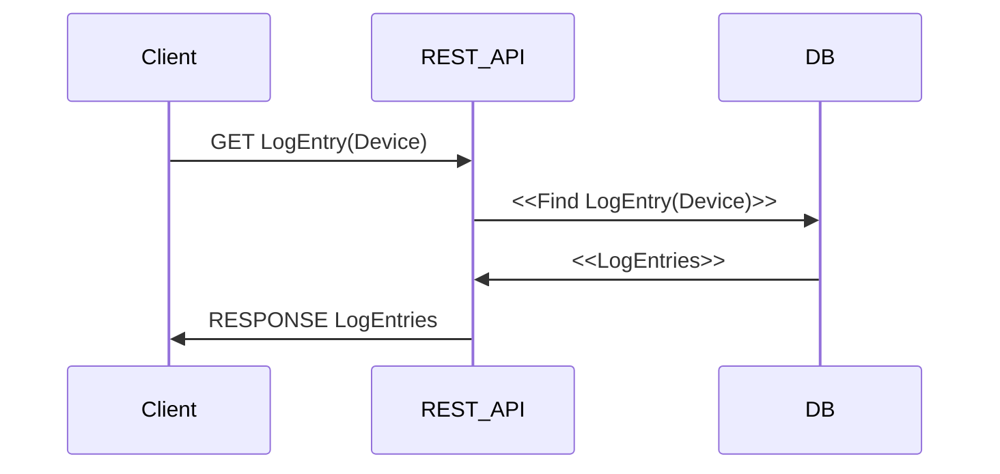
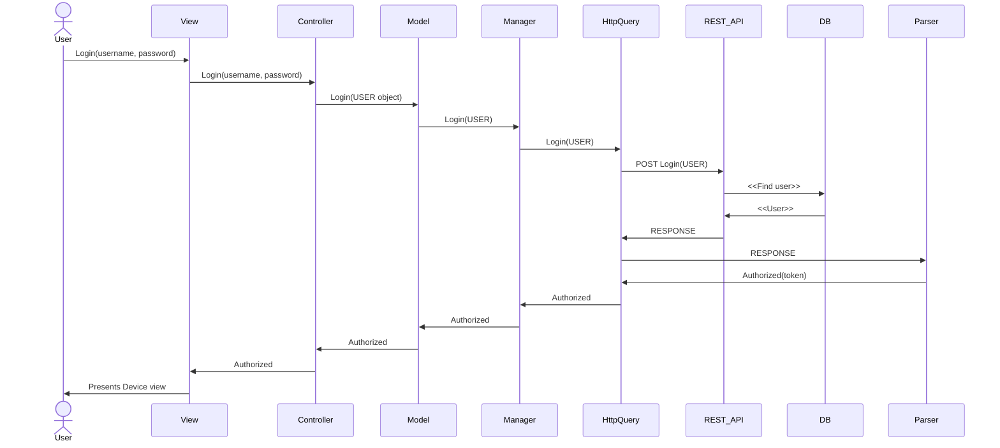

# I-SPY-U Sequence

### Login and get all devices

```mermaid
sequenceDiagram
    Client ->> REST_API: POST Login(user, password)
    REST_API ->> DB: <<Find user>>
    DB ->> REST_API: <<User>>
    REST_API ->> Client: RESPONSE Authorized(token)
```

### Get all devices

```mermaid
sequenceDiagram
    Client ->> REST_API: GET Devices(user)
    REST_API ->> DB: <<Find Devices user>>
    DB ->> REST_API: <<Devices>>
    REST_API ->> Client: RESPONSE Devices
```

### Sensor data update

```mermaid

sequenceDiagram
    Sensor ->> MQTT_Broker: PUBLISH(Topic=UUID, measurement)
    MQTT_Broker ->> REST_API: Sensor UUID X reported this measurement
    REST_API ->> DB: <<Create LogEntry(Device, key, value)>>
    DB ->> REST_API: <<Ok>>
```

### Sensor data retrieve

```mermaid
sequenceDiagram
    Client ->> REST_API: GET LogEntry(Device)
    REST_API ->> DB: <<Find LogEntry(Device)>>
    DB ->> REST_API: <<LogEntries>>
    REST_API ->> Client: RESPONSE LogEntries
```

### Client

```mermaid
sequenceDiagram
    actor User

    User ->> View: Login(username, password)
    View ->> Controller: Login(username, password)
    Controller ->> Model: Login(USER object)
    Model ->> Manager: Login(USER)
    Manager ->> HttpQuery: Login(USER)
    HttpQuery ->> REST_API: POST Login(USER)
    REST_API ->> DB: <<Find user>>
    DB ->> REST_API: <<User>>
    REST_API ->> HttpQuery: RESPONSE
    HttpQuery ->> Parser: RESPONSE
    Parser ->> HttpQuery: Authorized(token)
    HttpQuery ->> Manager: Authorized
    Manager ->> Model: Authorized
    Model ->> Controller: Authorized
    Controller ->> View: Authorized
    View ->> User: Presents Device view
```
