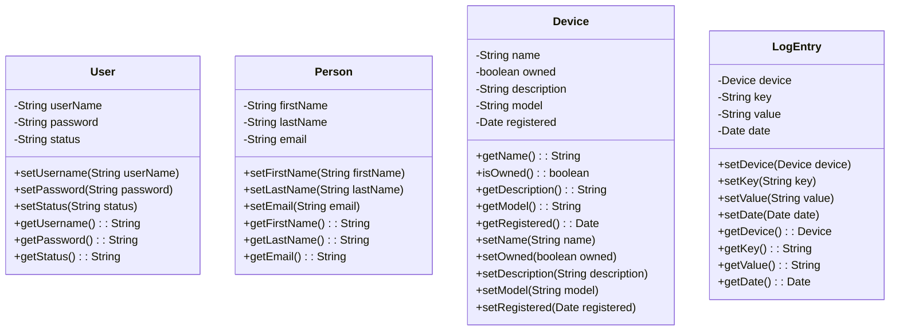

```mermaid

    classDiagram

    class User{
        -String userName
        -String password
        -String status

        +setUsername(String userName)
        +setPassword(String password)
        +setStatus(String status)

        +getUsername() : String
        +getPassword() : String
        +getStatus() : String
    }

    class Person{
        -String firstName
        -String lastName
        -String email

        +setFirstName(String firstName)
        +setLastName(String lastName)
        +setEmail(String email)

        +getFirstName() : String
        +getLastName() : String
        +getEmail() : String    
    }

    class Device{
        -String name
        -boolean owned
        -String description
        -String model
        -Date registered
    
        +getName() : String
        +isOwned() : boolean
        +getDescription() : String
        +getModel() : String
        +getRegistered() : Date

        +setName(String name)
        +setOwned(boolean owned)
        +setDescription(String description)
        +setModel(String model)
        +setRegistered(Date registered)
        
    }

    class LogEntry{
        -Device device
        -String key
        -String value
        -Date date

        +setDevice(Device device)
        +setKey(String key)
        +setValue(String value)
        +setDate(Date date)

        +getDevice() : Device
        +getKey() : String
        +getValue() : String
        +getDate() : Date
    }
    

```