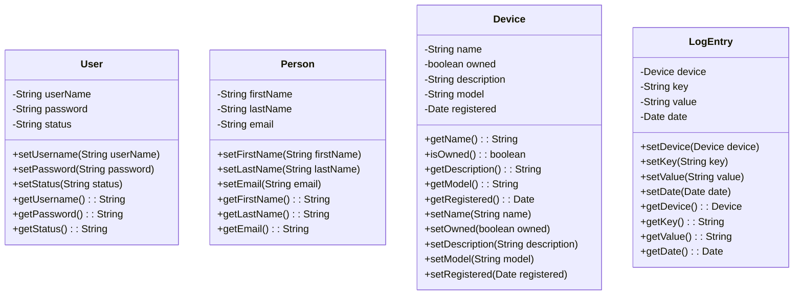
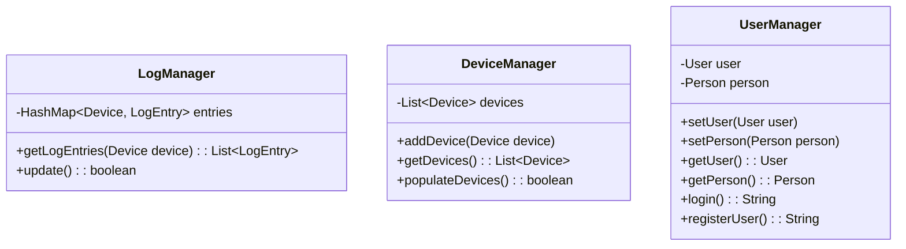
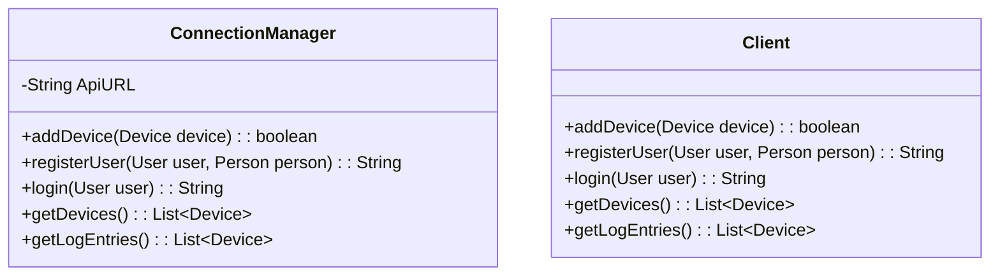
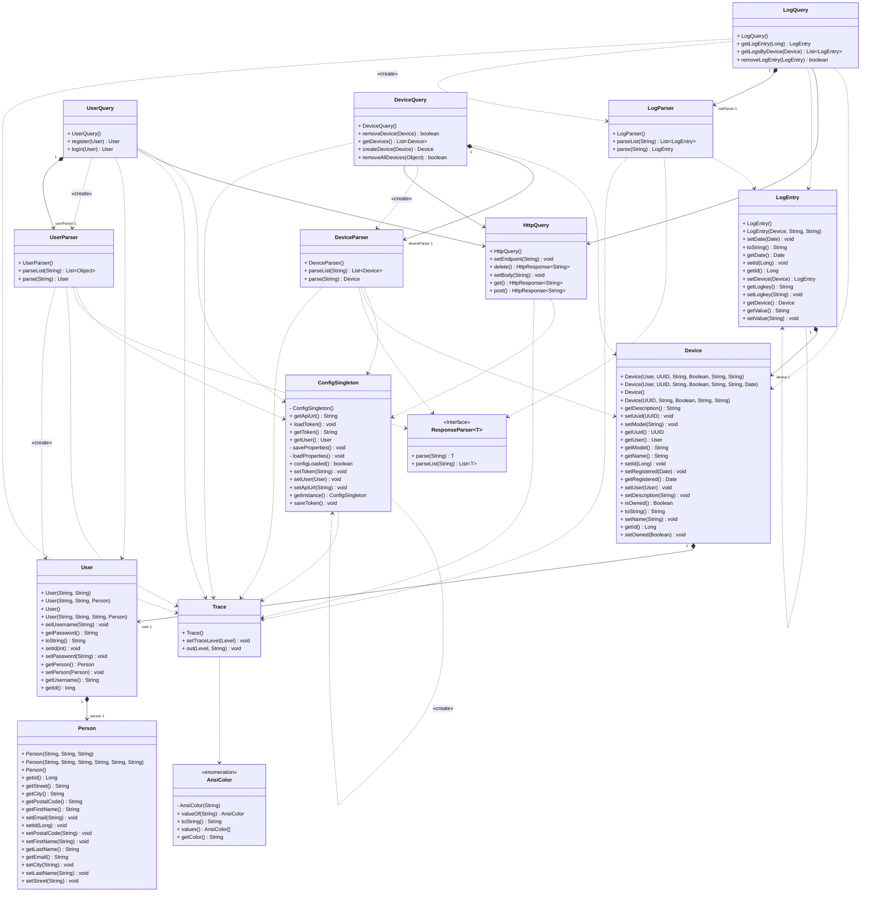

## Model

```mermaid

    classDiagram

    class User{
        -String userName
        -String password
        -String status

        +setUsername(String userName)
        +setPassword(String password)
        +setStatus(String status)

        +getUsername() : String
        +getPassword() : String
        +getStatus() : String
    }

    class Person{
        -String firstName
        -String lastName
        -String email

        +setFirstName(String firstName)
        +setLastName(String lastName)
        +setEmail(String email)

        +getFirstName() : String
        +getLastName() : String
        +getEmail() : String    
    }

    class Device{
        -String name
        -boolean owned
        -String description
        -String model
        -Date registered
    
        +getName() : String
        +isOwned() : boolean
        +getDescription() : String
        +getModel() : String
        +getRegistered() : Date

        +setName(String name)
        +setOwned(boolean owned)
        +setDescription(String description)
        +setModel(String model)
        +setRegistered(Date registered)
        
    }

    class LogEntry{
        -Device device
        -String key
        -String value
        -Date date

        +setDevice(Device device)
        +setKey(String key)
        +setValue(String value)
        +setDate(Date date)

        +getDevice() : Device
        +getKey() : String
        +getValue() : String
        +getDate() : Date
    }
```

## Manager

```mermaid

    classDiagram

    class LogManager{
        -HashMap~Device, LogEntry~ entries

        +getLogEntries(Device device) : List~LogEntry~
        +update() : boolean
    }

    class DeviceManager{
        -List~Device~ devices

        +addDevice(Device device)
        
        +getDevices() : List~Device~
        +populateDevices() : boolean
    }

    class UserManager{
        -User user
        -Person person

        +setUser(User user)
        +setPerson(Person person)
        
        +getUser() : User
        +getPerson() : Person

        +login() : String
        +registerUser() : String


    }
```

```mermaid

    classDiagram

    class ConnectionManager{
        -String ApiURL

        +addDevice(Device device) : boolean
        +registerUser(User user, Person person) : String
        +login(User user) : String

        +getDevices() : List~Device~
        +getLogEntries() : List~Device~
    }

    class Client{
        +addDevice(Device device) : boolean
        +registerUser(User user, Person person) : String
        +login(User user) : String

        +getDevices() : List~Device~
        +getLogEntries() : List~Device~
    }

    
    
```

### HTTP Query

```mermaid
classDiagram
    class HttpQuery {
        + HttpQuery() 
        + setEndpoint(String) void
        + delete() HttpResponse~String~
        + setBody(String) void
        + get() HttpResponse~String~
        + post() HttpResponse~String~
    }

    class LogQuery {
        + LogQuery() 
        + getLogEntry(Long) LogEntry
        + getLogsByDevice(Device) List~LogEntry~
        + removeLogEntry(LogEntry) boolean
    }

    class LogParser {
        + LogParser() 
        + parseList(String) List~LogEntry~
        + parse(String) LogEntry
    }

    class UserQuery {
        + UserQuery() 
        + register(User) User
        + login(User) User
    }

    class UserParser {
        + UserParser() 
        + parseList(String) List~Object~
        + parse(String) User
    }

    class DeviceParser {
        + DeviceParser() 
        + parseList(String) List~Device~
        + parse(String) Device
    }

    class DeviceQuery {
        + DeviceQuery() 
        + removeDevice(Device) boolean
        + getDevices() List~Device~
        + createDevice(Device) Device
        + removeAllDevices(Object) boolean
    }

    class ResponseParser~T~ {
        <<Interface>>
        + parse(String) T
        + parseList(String) List~T~
    }

    class LogEntry {
        + LogEntry() 
        + LogEntry(Device, String, String) 
        + setDate(Date) void
        + toString() String
        + getDate() Date
        + setId(Long) void
        + getId() Long
        + setDevice(Device) LogEntry
        + getLogkey() String
        + setLogkey(String) void
        + getDevice() Device
        + getValue() String
        + setValue(String) void
    }

    class Device {
        + Device(User, UUID, String, Boolean, String, String) 
        + Device(User, UUID, String, Boolean, String, String, Date) 
        + Device() 
        + Device(UUID, String, Boolean, String, String) 
        + getDescription() String
        + setUuid(UUID) void
        + setModel(String) void
        + getUuid() UUID
        + getUser() User
        + getModel() String
        + getName() String
        + setId(Long) void
        + setRegistered(Date) void
        + getRegistered() Date
        + setUser(User) void
        + setDescription(String) void
        + isOwned() Boolean
        + toString() String
        + setName(String) void
        + getId() Long
        + setOwned(Boolean) void
    }

    class User {
        + User(String, String) 
        + User(String, String, Person) 
        + User() 
        + User(String, String, String, Person) 
        + setUsername(String) void
        + getPassword() String
        + toString() String
        + setId(int) void
        + setPassword(String) void
        + getPerson() Person
        + setPerson(Person) void
        + getUsername() String
        + getId() long
    }

    class Person {
        + Person(String, String, String) 
        + Person(String, String, String, String, String, String) 
        + Person() 
        + getId() Long
        + getStreet() String
        + getCity() String
        + getPostalCode() String
        + getFirstName() String
        + setEmail(String) void
        + setId(Long) void
        + setPostalCode(String) void
        + setFirstName(String) void
        + getLastName() String
        + getEmail() String
        + setCity(String) void
        + setLastName(String) void
        + setStreet(String) void
    }

    class AnsiColor {
        <<enumeration>>
        - AnsiColor(String) 
        + valueOf(String) AnsiColor
        + toString() String
        + values() AnsiColor[]
        + getColor() String
    }

    class ConfigSingleton {
        - ConfigSingleton() 
        + getApiUrl() String
        + loadToken() void
        + getToken() String
        + getUser() User
        - saveProperties() void
        - loadProperties() void
        + configLoaded() boolean
        + setToken(String) void
        + setUser(User) void
        + setApiUrl(String) void
        + getInstance() ConfigSingleton
        + saveToken() void
    }

    class Trace {
        + Trace() 
        + setTraceLevel(Level) void
        + out(Level, String) void
    }

    DeviceParser  ..>  ConfigSingleton 
    DeviceParser  ..>  Device 
    DeviceParser  ..>  ResponseParser~T~ 
    DeviceParser  ..>  Trace 
    DeviceQuery  ..>  Device 
    DeviceQuery "1" *--> "deviceParser 1" DeviceParser 
    DeviceQuery  ..>  DeviceParser : «create»
    DeviceQuery  -->  HttpQuery 
    DeviceQuery  ..>  Trace 
    ConfigSingleton  ..>  ConfigSingleton : «create»
    ConfigSingleton  ..>  Trace 
    Trace  ..>  AnsiColor 
    User "1" *--> "person 1" Person 
    UserParser  ..>  ConfigSingleton 
    UserParser  ..>  ResponseParser~T~ 
    UserParser  ..>  Trace 
    UserParser  ..>  User : «create»
    UserQuery  ..>  ConfigSingleton 
    UserQuery  -->  HttpQuery 
    UserQuery  ..>  Trace 
    UserQuery  ..>  User 
    UserQuery  ..>  UserParser : «create»
    UserQuery "1" *--> "userParser 1" UserParser 
    LogParser  ..>  LogEntry 
    LogParser  ..>  ResponseParser~T~ 
    LogParser  ..>  Trace 
    LogQuery  ..>  Device 
    LogQuery  -->  HttpQuery 
    LogQuery  ..>  LogEntry 
    LogQuery "1" *--> "logParser 1" LogParser 
    LogQuery  ..>  LogParser : «create»
    LogQuery  ..>  Trace 
    LogEntry "1" *--> "device 1" Device 
    LogEntry  ..>  LogEntry 
    HttpQuery  ..>  ConfigSingleton 
    HttpQuery  ..>  Trace 
    Device "1" *--> "user 1" User 
    
```

```mermaid 
classDiagram
direction BT
class AddDeviceController {
  + AddDeviceController() 
  - handleAddDeviceButtonAction() void
  + start() void
}
class AnsiColor {
<<enumeration>>
  - AnsiColor(String) 
  + valueOf(String) AnsiColor
  + toString() String
  + values() AnsiColor[]
  + getColor() String
}
class Client {
  + Client() 
  + register(User) User
  + login(User) User
  + setRememberUser(boolean) void
  + logout() void
  + removeDevice(Device) boolean
  + getDevices(User) List~Device~
  + removeLogEntry(LogEntry) boolean
  + getLogEntries(Device) List~LogEntry~
  + addDevice(Device) Device
}
class ConfigSingleton {
  - ConfigSingleton() 
  + getApiUrl() String
  + loadToken() void
  + getToken() String
  + getUser() User
  - saveProperties() void
  - loadProperties() void
  + configLoaded() boolean
  + setToken(String) void
  + setUser(User) void
  + setApiUrl(String) void
  + getInstance() ConfigSingleton
  + saveToken() void
}
class ConnectionManager {
  + ConnectionManager() 
  + register(User) User
  + removeDevice(Device) boolean
  + getDevices() List~Device~
  + getLogEntries(Device) List~LogEntry~
  + removeLogEntry(LogEntry) boolean
  + createDevice(Device) Device
  + login(User) User
}
class Device {
  + Device(User, UUID, String, Boolean, String, String) 
  + Device(User, UUID, String, Boolean, String, String, Date) 
  + Device() 
  + Device(UUID, String, Boolean, String, String) 
  + getDescription() String
  + setUuid(UUID) void
  + setModel(String) void
  + getUuid() UUID
  + getUser() User
  + getModel() String
  + getName() String
  + setId(Long) void
  + setRegistered(Date) void
  + getRegistered() Date
  + setUser(User) void
  + setDescription(String) void
  + isOwned() Boolean
  + toString() String
  + setName(String) void
  + getId() Long
  + setOwned(Boolean) void
}
class DeviceController {
  + DeviceController() 
  - handleActionChoice() void
  - handleSetShare() void
  - setUpCharts() void
  - handleBackButton() void
  - handleShare() void
  - handleSetAction() void
  - handleSetLimits() void
  + start() void
}
class DeviceListController {
  + DeviceListController() 
  - addNewDevice(MouseEvent) void
  - openDevice(ActionEvent) void
  + start() void
  - switchToSharedDevices() void
  - switchToOwnDevices() void
  - ShowDeviceDetails(MouseEvent, Device) void
  - handleLogOut() void
  - getDevices(VBox) void
  + hook() void
  - addNewDeviceButton() Label
  - createNewDeviceLabel(Device) Label
}
class DeviceManager {
  + DeviceManager() 
  + removeAll(Object) boolean
  + read(Object) Object
  + remove(Object) boolean
  + update(Object) Object
  + create(Object) Device
  + readAll(Object) List~Device~
}
class DeviceParser {
  + DeviceParser() 
  + parseList(String) List~Device~
  + parse(String) Device
}
class DeviceQuery {
  + DeviceQuery() 
  + removeDevice(Device) boolean
  + getDevices() List~Device~
  + createDevice(Device) Device
  + removeAllDevices(Object) boolean
}
class DeviceShare {
  + DeviceShare() 
}
class GUI {
  + GUI() 
  + start(Stage) void
  + setUser(User) void
  + closePopup() void
  + setScene(String, int, int) void
  + popupHook() void
  + getUser() User
  + setCurrentDevice(Device) void
  + getLoader(String) Parent
  + getCurrentDevice() Device
  + openPopup(String, int, int, IController) void
}
class HoveredThresholdNodea {
  + HoveredThresholdNodea(String, Object) 
  - createDataThresholdLabel(String, Object) Label
}
class HttpQuery {
  + HttpQuery() 
  + setEndpoint(String) void
  + delete() HttpResponse~String~
  + setBody(String) void
  + get() HttpResponse~String~
  + post() HttpResponse~String~
}
class IController {
  + IController() 
  + setGUI(GUI) void
  + start() void
  - handleCloseButtonAction(ActionEvent) void
  + setClient(Client) void
  + hook() void
}
class IManager~T, S~ {
<<Interface>>
  + readAll(S) List~T~
  + removeAll(T) boolean
  + create(T) T
  + read(S) T
  + update(T) T
  + remove(T) boolean
}
class LogEntry {
  + LogEntry() 
  + LogEntry(Device, String, String) 
  + setDate(Date) void
  + toString() String
  + getDate() Date
  + setId(Long) void
  + getId() Long
  + setDevice(Device) LogEntry
  + getLogkey() String
  + setLogkey(String) void
  + getDevice() Device
  + getValue() String
  + setValue(String) void
}
class LogManager {
  + LogManager() 
  + update(Object) Object
  + remove(Object) boolean
  + removeAll(Object) boolean
  + readAll(Object) List~LogEntry~
  + read(Object) Object
  + create(Object) Object
}
class LogParser {
  + LogParser() 
  + parseList(String) List~LogEntry~
  + parse(String) LogEntry
}
class LogQuery {
  + LogQuery() 
  + getLogEntry(Long) LogEntry
  + getLogsByDevice(Device) List~LogEntry~
  + removeLogEntry(LogEntry) boolean
}
class LogSingController {
  + LogSingController() 
  + setErrorMsg(String) void
  + start() void
  - handleLogInButtonAction(ActionEvent) void
  - handleSingUpButtonAction(ActionEvent) void
}
class Main {
  + Main() 
  + main(String[]) void
}
class MyController {
  + MyController() 
  + showLogSingUP() void
  + showDeviceList() void
  + showDevice() void
  + showTest() void
}
class Person {
  + Person(String, String, String) 
  + Person(String, String, String, String, String, String) 
  + Person() 
  + getId() Long
  + getStreet() String
  + getCity() String
  + getPostalCode() String
  + getFirstName() String
  + setEmail(String) void
  + setId(Long) void
  + setPostalCode(String) void
  + setFirstName(String) void
  + getLastName() String
  + getEmail() String
  + setCity(String) void
  + setLastName(String) void
  + setStreet(String) void
}
class ResponseParser~T~ {
<<Interface>>
  + parse(String) T
  + parseList(String) List~T~
}
class TextController {
  + TextController() 
}
class TextView {
  + TextView() 
}
class Trace {
  + Trace() 
  + setTraceLevel(Level) void
  + out(Level, String) void
}
class User {
  + User(String, String) 
  + User(String, String, Person) 
  + User() 
  + User(String, String, String, Person) 
  + setUsername(String) void
  + getPassword() String
  + toString() String
  + setId(int) void
  + setPassword(String) void
  + getPerson() Person
  + setPerson(Person) void
  + getUsername() String
  + getId() long
}
class UserManager {
  + UserManager() 
  + update(User) User
  + logout(User) User
  + remove(User) User
  + login(User) User
  + register(User) User
}
class UserParser {
  + UserParser() 
  + parseList(String) List~Object~
  + parse(String) User
}
class UserQuery {
  + UserQuery() 
  + register(User) User
  + login(User) User
}

AddDeviceController  ..>  Client 
AddDeviceController  ..>  ConfigSingleton 
AddDeviceController  ..>  Device : «create»
AddDeviceController  ..>  GUI 
AddDeviceController  -->  IController 
AddDeviceController  ..>  Trace 
AnsiColor  ..>  AnsiColor 
Client  ..>  ConfigSingleton 
Client "1" *--> "connectionManager 1" ConnectionManager 
Client  ..>  ConnectionManager : «create»
Client  ..>  Device 
Client  ..>  LogEntry 
Client  ..>  Trace 
Client  ..>  User 
ConfigSingleton  ..>  ConfigSingleton : «create»
ConfigSingleton "1" *--> "instance 1" ConfigSingleton 
ConfigSingleton  ..>  Trace 
ConfigSingleton "1" *--> "user 1" User 
ConnectionManager  ..>  Device 
ConnectionManager "1" *--> "deviceManager 1" DeviceManager 
ConnectionManager  ..>  DeviceManager : «create»
ConnectionManager  ..>  LogEntry 
ConnectionManager  ..>  LogManager : «create»
ConnectionManager "1" *--> "logManager 1" LogManager 
ConnectionManager  ..>  Trace 
ConnectionManager  ..>  User 
ConnectionManager  ..>  UserManager : «create»
ConnectionManager "1" *--> "userManager 1" UserManager 
Device "1" *--> "user 1" User 
DeviceController  ..>  Client 
DeviceController "1" *--> "device 1" Device 
DeviceController  ..>  DeviceController 
DeviceController  ..>  GUI 
DeviceController  ..>  HoveredThresholdNodea : «create»
DeviceController  -->  IController 
DeviceController  ..>  LogEntry 
DeviceController  ..>  Trace 
DeviceController "1" *--> "user 1" User 
DeviceListController  ..>  Client 
DeviceListController "1" *--> "devices *" Device 
DeviceListController  ..>  DeviceListController 
DeviceListController  ..>  GUI 
DeviceListController  -->  IController 
DeviceListController  ..>  LogEntry 
DeviceListController  ..>  Trace 
DeviceManager  ..>  Device 
DeviceManager "1" *--> "deviceQuery 1" DeviceQuery 
DeviceManager  ..>  DeviceQuery : «create»
DeviceManager  ..>  IManager~T, S~ 
DeviceManager  ..>  Trace 
DeviceParser  ..>  ConfigSingleton 
DeviceParser  ..>  Device 
DeviceParser  ..>  ResponseParser~T~ 
DeviceParser  ..>  Trace 
DeviceQuery  ..>  Device 
DeviceQuery "1" *--> "deviceParser 1" DeviceParser 
DeviceQuery  ..>  DeviceParser : «create»
DeviceQuery  -->  HttpQuery 
DeviceQuery  ..>  Trace 
GUI "1" *--> "service 1" Client 
GUI  ..>  ConfigSingleton 
GUI "1" *--> "currentDevice 1" Device 
GUI  ..>  GUI 
GUI "1" *--> "kontrolleri 1" IController 
GUI "1" *--> "user 1" User 
HoveredThresholdNodea  ..>  HoveredThresholdNodea 
HttpQuery  ..>  ConfigSingleton 
HttpQuery  ..>  Trace 
IController  ..>  Client : «create»
IController "1" *--> "client 1" Client 
IController "1" *--> "gui 1" GUI 
LogEntry "1" *--> "device 1" Device 
LogEntry  ..>  LogEntry 
LogManager  ..>  Device 
LogManager  ..>  IManager~T, S~ 
LogManager  ..>  LogEntry 
LogManager "1" *--> "logQuery 1" LogQuery 
LogManager  ..>  LogQuery : «create»
LogManager  ..>  Trace 
LogParser  ..>  LogEntry 
LogParser  ..>  ResponseParser~T~ 
LogParser  ..>  Trace 
LogQuery  ..>  Device 
LogQuery  -->  HttpQuery 
LogQuery  ..>  LogEntry 
LogQuery "1" *--> "logParser 1" LogParser 
LogQuery  ..>  LogParser : «create»
LogQuery  ..>  Trace 
LogSingController  ..>  Client 
LogSingController  ..>  GUI 
LogSingController  -->  IController 
LogSingController  ..>  LogSingController 
LogSingController  ..>  Person : «create»
LogSingController  ..>  Trace 
LogSingController "1" *--> "awnser 1" User 
LogSingController  ..>  User : «create»
Main  ..>  GUI 
MyController  ..>  GUI 
MyController  -->  IController 
Person  ..>  Person 
Trace  ..>  AnsiColor 
User "1" *--> "person 1" Person 
User  ..>  User 
UserManager  ..>  ConfigSingleton 
UserManager  ..>  Trace 
UserManager  ..>  User 
UserManager  ..>  UserQuery : «create»
UserManager "1" *--> "userQuery 1" UserQuery 
UserParser  ..>  ConfigSingleton 
UserParser  ..>  ResponseParser~T~ 
UserParser  ..>  Trace 
UserParser  ..>  User : «create»
UserQuery  ..>  ConfigSingleton 
UserQuery  -->  HttpQuery 
UserQuery  ..>  Trace 
UserQuery  ..>  User 
UserQuery  ..>  UserParser : «create»
UserQuery "1" *--> "userParser 1" UserParser 
```